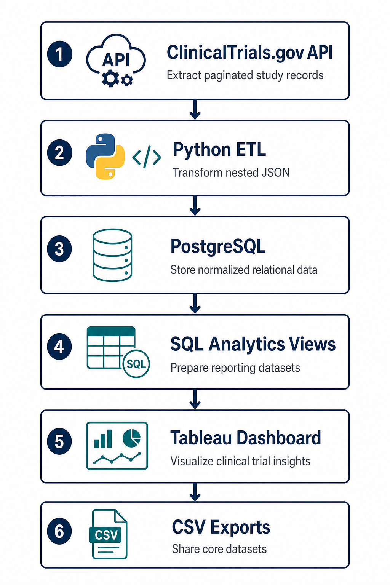

# Clinical Trials Landscape Analyzer

An end-to-end data engineering and business intelligence project that collects public clinical-trial data, transforms it into an analysis-ready relational model, and presents the results in an interactive Tableau dashboard.

The pipeline currently processes **5,000 studies** from the [ClinicalTrials.gov API v2](https://clinicaltrials.gov/data-api/api) and supports analysis by disease, phase, status, sponsor type, geography, enrollment, and time.

## Dashboard


## Problem

ClinicalTrials.gov provides a large amount of public study data, but the API response is nested and difficult to analyze directly. Answering basic landscape questions requires repeatedly parsing study records, conditions, phases, sponsors, dates, and locations.

This project turns that raw API data into a reusable analytics system that helps answer questions such as:

- Which disease areas have the most active research?
- How many trials complete or stop early at each phase?
- Which countries host the most trial activity?
- What types of organizations sponsor clinical trials?
- How has trial activity changed over time?
- How does enrollment differ across phases?

## Workflow



## Data collected

### Trial-level fields

- NCT identifier and study titles
- Overall recruitment/status value
- Study type
- Lead sponsor name and sponsor class
- Start, primary completion, and completion dates
- Enrollment count

### Related data

- Conditions or disease areas associated with each trial
- Clinical trial phases
- Trial-site country, state, and city

## Data model

| Table | Purpose |
|-------|---------|
| `trials` | One row per clinical trial with identifiers, status, sponsor, dates, and enrollment |
| `trial_conditions` | One-to-many disease/condition values linked by `nct_id` |
| `trial_phases` | One-to-many phase values linked by `nct_id` |
| `trial_locations` | One-to-many study locations linked by `nct_id` |

The analytics layer includes views for active conditions, completion by phase, country and US-state activity, sponsor mix, status summaries, study type, yearly trends, enrollment, recruiting activity, and a flat trial export.

## Tools and technologies

| Tool | Role |
|------|------|
| Python 3.12+ | API extraction, transformation, loading, and CSV export |
| Requests | ClinicalTrials.gov API communication |
| psycopg2 | PostgreSQL database access |
| PostgreSQL 16 | Primary database for normalized trial data and analytics views |
| Docker Compose | Reproducible database, ETL, and Adminer services |
| Adminer | Browser interface for inspecting PostgreSQL and running SQL queries |
| Tableau Desktop | Dashboard development and visualization |
| pytest / pytest-cov | Unit tests and coverage |
| GitHub Actions | Automated testing and Docker integration checks |
| Make | Short commands for setup, ETL, tests, and service management |

## Project structure

```text
clinical-trials-analyzer/
├── .github/
│   └── workflows/
│       └── ci.yml                    # Unit-test and Docker CI pipeline
├── data/
│   ├── trials.csv                    # Trial-level snapshot
│   ├── trial_conditions.csv          # Conditions snapshot
│   ├── trial_phases.csv              # Phases snapshot
│   └── trial_locations.csv           # Locations snapshot
├── etl/
│   ├── api_client.py                 # API requests and pagination
│   ├── config.py                     # Environment configuration
│   ├── db.py                         # Connections, schema setup, and database writes
│   ├── export_csv.py                 # Core-table CSV exports
│   ├── run_etl.py                    # Main ETL orchestration
│   └── transform.py                  # Nested JSON to normalized rows
├── screenshots/
│   ├── Clinical Trials Landscape Analyzer.png
│   ├── clinical-trials-workflow.png
│   └── *.png                         # Dashboard and SQL-result evidence
├── scripts/
│   └── verify_setup.sh               # API and database health check
├── sql/
│   ├── 01_schema.sql                 # Core tables, constraints, and indexes
│   └── 02_analytics_views.sql        # Reporting views used by Tableau
├── tests/
│   ├── fixtures.py                   # Shared test data
│   ├── test_api_client.py            # API-client tests
│   └── test_transform.py             # Transformation tests
├── .env.example                      # Example local configuration
├── Dockerfile                        # ETL container image
├── docker-compose.yml                # PostgreSQL, ETL, and Adminer services
├── Makefile                          # Project commands
├── pytest.ini                        # pytest configuration
└── requirements.txt                  # Python dependencies
```

## Setup and run

### 1. Prerequisites

Install:

- Python 3.12 or newer
- Git
- Docker Desktop with Docker Compose
- Make
- Tableau Desktop (only required to open or edit the dashboard)

Start Docker Desktop before running the project.

### 2. Clone and enter the repository

```bash
git clone <repository-url>
cd clinical-trials-analyzer
```

### 3. Create the Python environment

```bash
make setup
source .venv/bin/activate
```

`make setup` creates `.venv`, installs dependencies, and copies `.env.example` to `.env` when `.env` does not already exist.

### 4. Start PostgreSQL and Adminer

```bash
make db-up
```

Services:

- PostgreSQL: `localhost:5433`
- Adminer: [http://localhost:8080](http://localhost:8080)

### 5. Run the ETL

```bash
make etl
```

This fetches the configured number of studies, initializes the schema and analytics views, loads PostgreSQL, and exports the four core CSV files under `data/`.

### 6. Verify the installation

```bash
make verify
```

The health check confirms that Python works, PostgreSQL is reachable, trial data exists, and the ClinicalTrials.gov API responds.

### 7. Run tests

```bash
make test
```

### Alternative: run the full pipeline in Docker

```bash
make up
```

This builds the ETL image and starts the Compose services. The terminal remains attached to container logs; use `Ctrl+C` when finished.

## Database access

### What PostgreSQL and Adminer do

**PostgreSQL** is the project database. The ETL stores the normalized clinical-trial records in PostgreSQL, and the SQL analytics views prepare that data for Tableau.

**Adminer** is a lightweight browser interface for PostgreSQL. It does not store separate data. It connects to PostgreSQL so you can inspect tables, run SQL queries, and capture result screenshots without using the terminal.

There are two optional ways to open the PostgreSQL database. Both show the same data, so choose whichever is easier:

- Use **Adminer** for a visual browser interface and easy query-result screenshots.
- Use the **PostgreSQL command line** if you prefer typing SQL directly in a terminal.

### Adminer

Open [http://localhost:8080](http://localhost:8080) and use:

| Field | Value |
|-------|-------|
| System | PostgreSQL |
| Server | `db` |
| Username | `trials_user` |
| Password | `trials_pass` |
| Database | `clinical_trials` |

These credentials are for local development only.

### PostgreSQL terminal

```bash
docker compose exec db psql -U trials_user -d clinical_trials
```

Exit with `\q`.

## SQL analysis and screenshots

The screenshots under `screenshots/` were created by running the following queries in Adminer.

### 1. Total trials loaded

```sql
SELECT COUNT(*) AS trials
FROM trials;
```

Screenshot: `screenshots/01-total-trials-loaded.png`

### 2. Top 10 disease areas with active trials

```sql
SELECT *
FROM v_active_trials_by_condition
LIMIT 10;
```

Screenshot: `screenshots/02-top-10-active-diseases.png`

### 3. Completion and early stopping by phase

```sql
SELECT *
FROM v_completion_rates_by_phase;
```

Screenshot: `screenshots/03-completion-by-phase.png`

### 4. Top 10 countries by trial activity

```sql
SELECT *
FROM v_trials_by_country
LIMIT 10;
```

Screenshot: `screenshots/04-top-10-countries-by-trials.png`

### 5. Trial distribution by sponsor type

```sql
SELECT *
FROM v_trials_by_sponsor_class;
```

Screenshot: `screenshots/05-trials-by-sponsor-type.png`

### 6. Overall trial status summary

```sql
SELECT *
FROM v_trial_status_summary;
```

Screenshot: `screenshots/06-trial-status-summary.png`

### 7. Recent trial starts by year

```sql
SELECT *
FROM v_trials_started_by_year
ORDER BY start_year DESC
LIMIT 10;
```

Screenshot: `screenshots/07-recent-trials-by-start-year.png`

## Tableau

To connect Tableau Desktop to the running database:

| Field | Value |
|-------|-------|
| Server | `localhost` |
| Port | `5433` |
| Database | `clinical_trials` |
| Username | `trials_user` |
| Password | `trials_pass` |

If Tableau requests a PostgreSQL driver, download the JDBC driver from [pgJDBC](https://jdbc.postgresql.org/download/), place the `.jar` file in `~/Library/Tableau/Drivers`, and restart Tableau.

## CSV exports

The ETL writes only the four core datasets to `data/`:

- `trials.csv`
- `trial_conditions.csv`
- `trial_phases.csv`
- `trial_locations.csv`

Regenerate them from the current database without refetching the API:

```bash
make export
```

Analytics views remain in PostgreSQL and are not duplicated as CSV files.

## Configuration

Copy `.env.example` to `.env` (handled automatically by `make setup`) and adjust:

| Variable | Default | Purpose |
|----------|---------|---------|
| `DATABASE_URL` | PostgreSQL on `localhost:5433` | Local database connection |
| `API_BASE_URL` | ClinicalTrials.gov API v2 | API endpoint |
| `PAGE_SIZE` | `100` | Studies requested per API page |
| `MAX_STUDIES` | `5000` | Maximum studies to process; `0` means no limit |

Use a smaller `MAX_STUDIES` for a quick development run. Running without a limit can take substantially longer.

## Available commands

| Command | Purpose |
|---------|---------|
| `make setup` | Create virtual environment and install dependencies |
| `make db-up` | Start PostgreSQL and Adminer in the background |
| `make etl` | Run the ETL locally against Docker PostgreSQL |
| `make export` | Regenerate the four raw CSV exports |
| `make verify` | Check Python, database data, and API access |
| `make test` | Run unit tests with coverage |
| `make up` | Build and run the full Docker Compose pipeline |
| `make logs` | Follow Docker Compose logs |
| `make down` | Stop containers while retaining database data |
| `make clean` | Stop containers and delete the database volume |

## Testing and continuous integration

Unit tests validate API pagination behavior and transformation of API responses into normalized rows. GitHub Actions runs:

1. Python dependency installation
2. Unit tests and coverage
3. Docker image build
4. A 50-study integration ETL against PostgreSQL
5. Database-load verification

## Troubleshooting

| Problem | Resolution |
|---------|------------|
| Docker API connection fails | Start Docker Desktop and wait until it is ready |
| PostgreSQL connection is refused | Run `make db-up` and use port `5433` from the host |
| Adminer cannot connect | Use server `db`, not `localhost`, inside Adminer |
| Tableau cannot connect | Use server `localhost`, port `5433`, and install the PostgreSQL driver |
| ETL takes too long | Lower `MAX_STUDIES` in `.env` |
| Old database credentials remain | Run `make clean`, then `make db-up` and `make etl` (deletes local DB data) |
